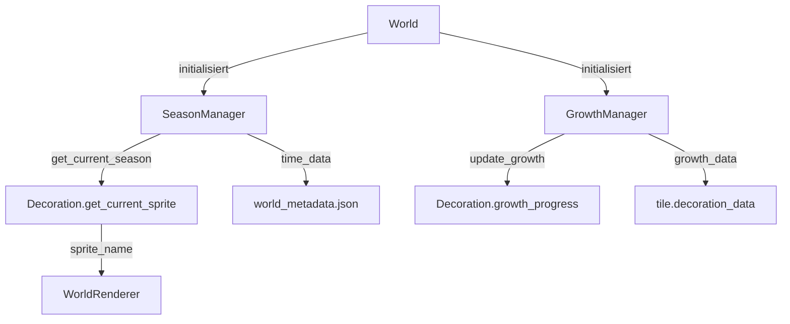

# Seasons & Growth System - Implementierungsplan

## Übersicht

Implementierung eines vollständigen Seasons & Growth Systems für Decorations (insbesondere Bäume) mit:

- 4 Jahreszeiten (Spring, Summer, Autumn, Winter) mit pro-Welt Zeitverwaltung
- 4 Wachstumsstadien (Sprössling → Junger Baum → Mittel → Ausgewachsen)
- Season-spezifische Sprites mit smooth Übergängen (2 Tage Mischung)
- Snowy-Variants für Winter
- Automatisches Wachstum basierend auf Season und Zeit

## Architektur



## Dateien

### Neue Dateien

1. **`data/mappings/seasons.json`** - Season-Konfiguration

   - Definition aller 4 Jahreszeiten mit Dauer, Growth-Multiplier, Weather, Tint
   - World-Settings (start_season, day_length_seconds, transition_duration_days)

2. **`world/season_manager.py`** - Season-Verwaltung

   - Lädt `seasons.json`
   - Verwaltet In-Game-Zeit (Tage, aktuelle Season)
   - Berechnet Season-Übergänge (smooth transitions über 2 Tage)
   - Speichert/Lädt Zeit-Daten in `world_metadata.json`
   - Methoden: `get_current_season()`, `get_growth_speed_multiplier()`, `is_snowing()`, `get_season_tint()`, `get_transition_progress()`

3. **`world/growth_manager.py`** - Growth-Verwaltung

   - Verwaltet Wachstum von Decorations
   - Prüft Growth-Requirements (season_allowed, min_temperature)
   - Aktualisiert `growth_progress` basierend auf Season-Multiplier und Stage-Multiplier
   - Wechselt Wachstumsstadien wenn `growth_progress >= next_stage.growth_time`
   - Stumpf-Removal-Timer mit optionalem Regrow (120s, 10% Chance)
   - Growth-Pause bei Low-Health (<50% Health = kein Wachstum)
   - Performance: Update-Throttling (nur alle 5 Sekunden, nicht jeden Frame)
   - Methoden: `update_growth(decoration, tile_data, dt)`, `can_grow()`, `advance_stage()`, `update_stump_removal()`

### Zu erweiternde Dateien

4. **`data/decorations/core/maple_tree.json`** - Überarbeitung

   - `growth.stages` als Array mit `size_multiplier`, `collision_radius`, `sprite_offset`, `growth_speed_multiplier` (pro Stage)
   - `growth.growth_requirements` (min_temperature, seasons_allowed, min_light_level)
   - `seasons.sprite_base_path` für konsistente Pfade
   - `placement.spawn_stage` mit Gewichtung
   - `autumn.special_drops` für Season-spezifische Loot
   - `mining.stump_removal` (enabled, timer: 120.0, regrow_chance: 0.1)

5. **`world/decoration.py`** - Erweiterung

   - `get_current_sprite(season_manager, growth_manager, tile_data)` - Berücksichtigt Season + Stage + Damage + Snow
   - `get_current_stage(tile_data)` - Gibt aktuellen Growth-Stage zurück
   - `get_health_percentage(tile_data)` - Für Damage-Sprite-Wahl
   - Sprite-Selection-Logik: Season → Stage → Health → Snow

6. **`world/world.py`** - Integration

   - Initialisiert `SeasonManager` und `GrowthManager` im `__init__`
   - Ruft `SeasonManager.update(dt)` und `GrowthManager.update_all(dt)` in `update()` auf
   - Speichert Season-Daten in `world_metadata.json` via `ChunkManager`

7. **`view/world_renderer.py`** - Rendering

   - `_render_decorations_and_player()`: Ruft `decoration.get_current_sprite()` mit SeasonManager/GrowthManager auf
   - Unterstützt Sprite-Mischung für Season-Übergänge (2 Sprites mit Alpha-Blending)
   - Lädt Season-spezifische Sprites über `DecorationTextureManager`
   - `render_season_transition_overlay()`: Screen-Tint-Overlay während Season-Übergängen
   - `render_growth_tooltip()`: Zeigt Growth-Progress als Tooltip beim Hovern

8. **`world/chunk_manager.py`** - Speichern/Laden

   - Erweitert `world_metadata.json` um `season_data` (current_day, current_season, elapsed_time)
   - Lädt Season-Daten beim World-Start
   - Speichert Season-Daten bei Auto-Save

9. **`view/decoration_texture_manager.py`** - Sprite-Loading

   - Unterstützt Season-Pfade: `assets/decorations/{mod_id}/{season}/{sprite_name}.png`
   - Lädt alle Season-Sprites für eine Decoration (preload für smooth transitions)

## Implementierungsdetails

### SeasonManager (`world/season_manager.py`)

**Kern-Logik:**

- Zeit-Tracking: `elapsed_time += dt` → `current_day = elapsed_time / day_length_seconds`
- Season-Wechsel: Wenn `current_day > season_duration` → `advance_season()`
- Transition: `transition_progress = (current_day - season_start_day) / transition_duration_days` (0.0-1.0)
- Snow-Check: Winter + `random.random() < snow_chance` → `is_snowing = True`

**Methoden:**

```python
class SeasonManager:
    @classmethod
    def load_all(cls, data_path: str = "data/mappings/seasons.json")
    @classmethod
    def initialize_world(cls, world_name: str, chunk_manager)
    @classmethod
    def update(cls, dt: float)  # Triggert Event bei Season-Wechsel
    @classmethod
    def get_current_season(cls) -> str
    @classmethod
    def get_growth_speed_multiplier(cls) -> float
    @classmethod
    def is_snowing(cls) -> bool
    @classmethod
    def get_season_tint(cls) -> Tuple[int, int, int, int]
    @classmethod
    def get_next_season_tint(cls) -> Tuple[int, int, int, int]  # Für Transition-Overlay
    @classmethod
    def get_transition_progress(cls) -> float  # 0.0-1.0 für Sprite-Mischung
    @classmethod
    def get_next_season(cls) -> str
    @classmethod
    def force_season(cls, season: str)  # Debug: Force Season-Wechsel
    @classmethod
    def skip_time(cls, days: float)  # Debug: Time-Skip (+1 Tag = T-Taste)
```

### GrowthManager (`world/growth_manager.py`)

**Kern-Logik:**

- Update-Throttling: Nur alle 5 Sekunden (nicht jeden Frame) für Performance
- Für jede Decoration mit `growth.enabled`:
  - Prüfe `can_grow()` (season_allowed, min_temperature, health_percent >= 0.5)
  - `effective_growth_speed = SeasonManager.get_growth_speed_multiplier() * stage.growth_speed_multiplier`
  - `growth_progress += dt * effective_growth_speed`
  - Wenn `growth_progress >= next_stage.growth_time` → `advance_stage()` (mit Partikel-Effekt)
  - Update `tile.decoration_data['current_stage'] `und `collision_radius`
- Stumpf-Removal: Wenn `is_stump` → `stump_timer += dt`, bei Timer >= 120s → entfernen oder regrow (10% Chance)

**Methoden:**

```python
class GrowthManager:
    @classmethod
    def initialize(cls)
    @classmethod
    def update_all(cls, world, dt: float)  # Mit Throttling (5s Interval)
    @classmethod
    def update_growth(cls, decoration, tile_data, dt: float)
    @classmethod
    def can_grow(cls, decoration, tile_data, season: str) -> bool  # Prüft auch health_percent >= 0.5
    @classmethod
    def advance_stage(cls, decoration, tile_data)  # Spawns particles
    @classmethod
    def update_stump_removal(cls, decoration, tile_data, dt: float)  # Stumpf-Timer + Regrow
    @classmethod
    def force_grow_all(cls, world)  # Debug: Force-Grow alle Decorations
```

### Decoration-Erweiterung (`world/decoration.py`)

**Neue Methoden:**

```python
def get_current_sprite(self, season_manager, growth_manager, tile_data: dict) -> str:
    """Gibt aktuellen Sprite-Namen zurück basierend auf Season + Stage + Damage + Snow"""
    current_season = season_manager.get_current_season()
    current_stage = self.get_current_stage(tile_data)
    health_percent = self.get_health_percentage(tile_data)
    is_snowy = season_manager.is_snowing() and current_season == "winter"
    
    # Sprite-Selection-Logik
    seasons_config = self.config.get('seasons', {})
    if not seasons_config.get('enabled', False):
        # Fallback zu altem System
        return self._get_fallback_sprite(health_percent)
    
    season_config = seasons_config.get(current_season, {})
    growth_stages = season_config.get('growth_stages_snowy' if is_snowy else 'growth_stages', {})
    
    # Wähle Sprite basierend auf Stage
    sprite_name = growth_stages.get(str(current_stage))
    
    # Override mit Damage-Sprite wenn beschädigt
    if health_percent < 0.5:
        damaged_sprites = season_config.get('damaged_sprites_snowy' if is_snowy else 'damaged_sprites', {})
        if health_percent < 0.1:
            sprite_name = season_config.get('stump_snowy' if is_snowy else 'stump', sprite_name)
        else:
            sprite_name = damaged_sprites.get('damaged_50', sprite_name)
    
    return sprite_name

def get_current_stage(self, tile_data: dict) -> int:
    """Gibt aktuellen Growth-Stage zurück (1-4)"""
    return tile_data.get('current_stage', self.config.get('growth', {}).get('default_stage', 4))

def get_health_percentage(self, tile_data: dict) -> float:
    """Gibt Health-Prozent zurück (1.0 = voll, 0.0 = zerstört)"""
    # Berechnet aus mining elapsed_time / time_to_mine
    # Oder aus decoration_data['health'] / max_health
    ...
```

### World-Integration (`world/world.py`)

**Änderungen:**

```python
def __init__(self, ...):
    # ... existing code ...
    
    # Initialize SeasonManager and GrowthManager
    from world.season_manager import SeasonManager
    from world.growth_manager import GrowthManager
    
    SeasonManager.load_all()
    SeasonManager.initialize_world(world_name, self.chunk_manager)
    
    GrowthManager.initialize()

def update(self, ...):
    # ... existing code ...
    
    # Update seasons and growth
    SeasonManager.update(dt)
    GrowthManager.update_all(self, dt)
```

### Rendering-Erweiterung (`view/world_renderer.py`)

**Änderungen in `_render_decorations_and_player()`:**

```python
# Get season manager and growth manager
from world.season_manager import SeasonManager
from world.growth_manager import GrowthManager

# Get current sprite with season/growth support
sprite_name = decoration.get_current_sprite(
    SeasonManager, 
    GrowthManager, 
    deco_data_dict
)

# Check for season transition (smooth blending)
transition_progress = SeasonManager.get_transition_progress()
if transition_progress > 0.0 and transition_progress < 1.0:
    # Render both sprites with alpha blending
    current_season = SeasonManager.get_current_season()
    next_season = SeasonManager.get_next_season()
    # Render current_season sprite with alpha = 1.0 - transition_progress
    # Render next_season sprite with alpha = transition_progress
```

## Datenstrukturen

### world_metadata.json (erweitert)

```json
{
  "seed": 12345,
  "season_data": {
    "current_day": 42.5,
    "current_season": "autumn",
    "elapsed_time": 25500.0,
    "season_start_day": 40.0,
    "is_snowing": false
  }
}
```

### tile.decoration_data (erweitert)

```python
{
    "decoration_id": "maple_tree",
    "current_stage": 3,  # 1-4
    "growth_progress": 650.0,  # Sekunden seit Stage-Start
    "sprite_state": "default",  # default, damaged_50, stump
    "elapsed_time": 0.0,  # Mining progress
    "is_stump": False,
    "stump_timer": 0.0,  # Timer für Stumpf-Removal (120s)
    "health": 100,  # Optional: Explizite Health (sonst aus mining elapsed_time berechnet)
    "max_health": 100  # Max Health für Health-Percentage-Berechnung
}
```

### seasons.json (erweitert)

```json
{
  "seasons": {
    "spring": {
      "growth_speed_multiplier": 1.5,
      "day_night_ratio": 0.6,  // Optional: 60% Tag, 40% Nacht
      "sunrise_time": 6.0,
      "sunset_time": 20.0
    },
    "winter": {
      "growth_speed_multiplier": 0.0,
      "day_night_ratio": 0.4,  // Längere Nächte im Winter
      "sunrise_time": 8.0,
      "sunset_time": 16.0
    }
  }
}
```

## Reihenfolge der Implementierung

### Phase 1: Core-System

1. **seasons.json** erstellen mit vollständiger Konfiguration
2. **SeasonManager** erstellen und testen (Zeit-Tracking, Season-Wechsel, world_metadata.json)
3. **maple_tree.json** überarbeiten (neue Struktur mit growth_speed_multiplier, stump_removal)
4. **GrowthManager** erstellen (Wachstums-Logik mit Throttling, Stump-Removal)
5. **Decoration-Erweiterung** (get_current_sprite mit Season/Stage/Health/Snow)
6. **World-Integration** (SeasonManager/GrowthManager in update())

### Phase 2: Rendering & Visuals

7. **DecorationTextureManager** erweitern (Season-Pfade)
8. **WorldRenderer** erweitern (get_current_sprite Aufruf, Season-Sprites laden)
9. **Smooth Transitions** (Sprite-Mischung für Übergänge)
10. **Season-Transition-Overlay** (Screen-Tint während Übergängen)
11. **Growth-Progress-Tooltip** (beim Hovern über wachsende Decorations)

### Phase 3: Features & Polish

12. **Stump-Removal-System** (Timer + Regrow-Chance)
13. **Season-Loot-Multiplier** (mehr Blätter im Herbst)
14. **Growth-Stage-Particles** (visuelles Feedback beim Wachsen)
15. **Season-Change-Notification** (UI-Banner für Season-Wechsel)
16. **Season-Change-Event** (für zukünftige Quests/Achievements)

### Phase 4: Debug & Testing

17. **Debug-Commands** (F1-F4 für Seasons, T für Time-Skip, G für Force-Grow)
18. **Speichern/Laden** (world_metadata.json erweitern, Savegame-Migration für bestehende Welten)

## Sprite-Naming-Convention

**Format:** `{season}*{tree}*{stage}[_{variant}].png`

**Beispiele:**

- `spring_maple_1.png` - Spring, Stage 1 (Sprössling)
- `autumn_maple_4.png` - Autumn, Stage 4 (Ausgewachsen)
- `winter_maple_3_snowy.png` - Winter, Stage 3, Snowy-Variant
- `summer_maple_damaged_50.png` - Summer, 50% beschädigt
- `spring_maple_stump.png` - Spring, Stumpf

**Ordnerstruktur:**

```
assets/decorations/core/
├── spring_maple_1.png
├── spring_maple_2.png
├── spring_maple_3.png
├── spring_maple_4.png
├── summer_maple_1.png
...
├── winter_maple_4_snowy.png
└── winter_maple_stump_snowy.png
```

**Alternative:** Season-Unterordner (falls gewünscht):

```
assets/decorations/core/
├── spring/
│   ├── maple_1.png
│   ├── maple_2.png
│   └── ...
├── summer/
│   └── ...
└── winter/
    └── ...
```

## Debug-Commands (Dev-Mode)

**Tastatur-Shortcuts:**

- **F1-F4**: Force Season-Wechsel (Spring, Summer, Autumn, Winter)
- **T**: Time-Skip (+1 Tag vorwärts)
- **G**: Force-Grow alle Decorations (skip to next stage)

**Implementierung:** In `core/world_controller.py` oder `main_pyglet.py` (nur wenn `dev_mode=True`)

## Season-Loot-Multiplier

**Erweiterung für Loot-Tables:**

```json
{
  "item_id": "maple_leaf",
  "quantity": {"min": 1, "max": 3},
  "season_multiplier": {
    "autumn": 2.5  // 2.5x mehr Blätter im Herbst!
  }
}
```

**Berechnung:** `final_quantity = base_quantity * season_multiplier.get(current_season, 1.0)`

## Wichtige Hinweise

- **Sprite-Pfade**: Season-Sprites müssen im Format `{season}_{tree}_{stage}.png` vorliegen (z.B. `spring_maple_1.png` in `assets/decorations/core/`)
- **Performance**: Growth-Updates mit Throttling (nur alle 5 Sekunden, nicht jeden Frame)
- **Backward Compatibility**: Decorations ohne `seasons.enabled` nutzen weiterhin das alte Sprite-System
- **Testing**: Season-Wechsel testen (20 Tage pro Season = 80 Tage für kompletten Zyklus)
- **Growth-Speed**: Pro Stage kann `growth_speed_multiplier` definiert werden (Sprösslinge wachsen schneller)
- **Stump-Removal**: Stumpf verschwindet nach 120s, 10% Chance auf Regrow als Sprössling
- **Health-Check**: Bäume wachsen nicht mehr wenn Health < 50%
- **Season-Transitions**: Smooth Sprite-Mischung über 2 Tage + Screen-Tint-Overlay